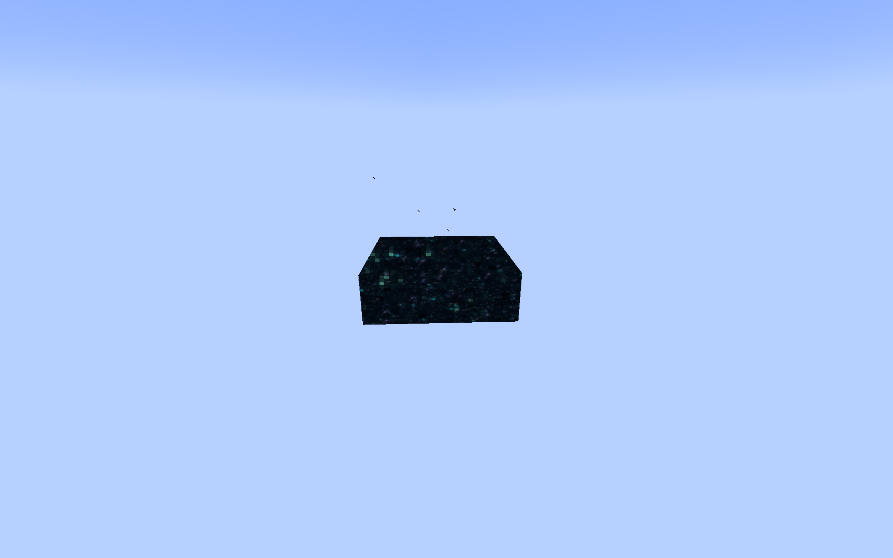

[中文](README_ZH.md)
# EndPortalFix
Fix the rendering of End Portals 
Usage: Command 
/endportalfix 0 [Vanilla] 
 
/endportalfix 1 [Actual] 
 
/endportalfix 2 [Complete] 
 
<h5>Note: The complete mode does not support shaders. Under shaders, the behavior is the same as the actual mode.
</h5>
